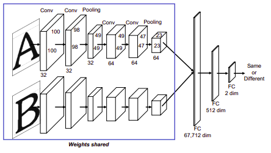
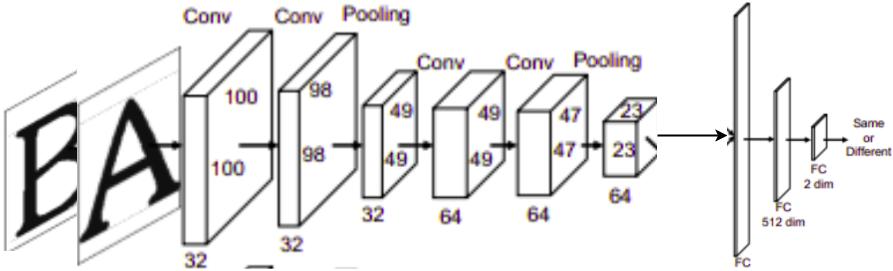

# Character-independent font identification

Pytorch implement for [Character-independent font identification](https://arxiv.org/pdf/2001.08893.pdf)

**Dataset:**
- [Images](https://drive.google.com/file/d/1qmSGYIL__YKBeEeMfpbyvJLlFl5CZLX2/view?usp=sharing): 1016 font of 64 character images from google font
- [Train csv](https://drive.google.com/file/d/15v7m3dRE7yNmKVL_phTqJe4UmmA-oR-a/view?usp=sharing): pair images for training
- [Val csv](https://drive.google.com/file/d/1abFVdoWD-9himnGHLDUbTYaNvxHeQ1ph/view?usp=sharing): pair images for validation
- [Test csv](https://drive.google.com/file/d/1SS9bsjqzuh7XPOcmkuAUz944k0xF8qEQ/view?usp=sharing): pair images for testing

**Config file:**

- 2flow.yaml: original paper. Two images forward a shared weights network

- 1flow.yaml: I modify the flow that the combine pair images before forwarding the network

- Instead only use the Conv, I use sequential of [Conv, BatchNorm, ReLU layer] and the data padded to same size 64x64 pixel 

- Combine 1flow data pipeline and sequential layer, it push the accuracy from 0.82 -> 0.93 (for my dataset)
